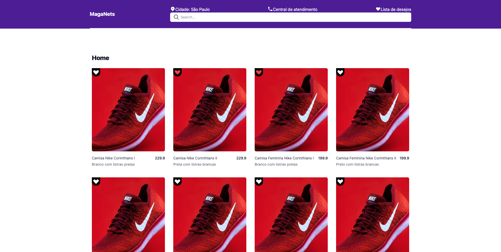

<p align="center">
  

  

  <a href="https://www.twitter.com/wandchavesbr/">
    
  </a>
  
  <a href="https://github.com/wandersonchaves/maganets/commits/master">
    
  </a>
    
   
   <a href="https://github.com/wandersonchaves/maganets/">
    
  </a>

  <a href="https://chav3x.com.br">
    
  </a>
  
  <a href="https://blog.chav3x.com.br/">
    
    </a>
  
 
</p>
<h1 align="center">
    
</h1>

<h4 align="center"> 
	🚧  Maganets ♻️ Concluído 🚀 🚧
</h4>

<p align="center">
 <a href="#-sobre-o-projeto">Sobre</a> •
 <a href="#-funcionalidades">Funcionalidades</a> •
 <a href="#-layout">Layout</a> • 
 <a href="#-como-executar-o-projeto">Como executar</a> • 
 <a href="#-tecnologias">Tecnologias</a> • 
 <a href="#-contribuidores">Contribuidores</a> • 
 <a href="#-autor">Autor</a> • 
 <a href="#user-content--licença">Licença</a>
</p>

## 💻 Sobre o projeto

♻️ Maganets - é uma aplicação onde o seu principal objetivo é permitir o usuário selecionar os produtos de sua preferência e armazená-los na sua Wishlist e a qualquer momento o mesmp pode visualizar sua Wishlist completa.

---

## ⚙️ Funcionalidades

- [x] Uma página de listagem de produtos, onde o cliente poderá adicionar/remover os produtos na wishlist;
- [x] Outra página onde o cliente poderá listar os produtos que estão na wishlist e remover se desejar;

---

## 🚀 Como executar o projeto

Este projeto tem duas partes:

1. Frontend (client)
2. Backend (server)

💡O Frontend (client) precisa que o Backend (server) esteja sendo executado para funcionar.

### Pré-requisitos

Antes de começar, você vai precisar ter instalado em sua máquina as seguintes ferramentas:
[Git](https://git-scm.com), [Node.js](https://nodejs.org/en/).
Além disto é bom ter um editor para trabalhar com o código como [VSCode](https://code.visualstudio.com/)

#### 🎲 Rodando o Backend (server)

```bash

# Clone este repositório
$ git clone git@github.com:wandersonchaves/maganets.git

# Acesse a pasta do projeto no terminal/cmd
$ cd maganets/server

# Instale as dependências
$ yarn or yarn install

# Execute a aplicação em modo de desenvolvimento
$ yarn dev

# O servidor inciará na porta:3333 - acesse http://localhost:3333

```

#### 🎲 Rodando o Frontend (client)

```bash

# Clone este repositório
$ git clone git@github.com:wandersonchaves/maganets.git

# Acesse a pasta do projeto no terminal/cmd
$ cd maganets/client

# Instale as dependências
$ yarn or yarn install

# Execute a aplicação em modo de desenvolvimento
$ yarn dev

# O servidor inciará na porta:3333 - acesse http://localhost:3333

```

## 🛠 Tecnologias

As seguintes ferramentas foram usadas na construção do projeto:

#### **Website** ([Next](https://nextjs.org/) + [TypeScript](https://www.typescriptlang.org/) + [NodeJS](https://nodejs.org/en/))

- **[Axios](https://github.com/axios/axios)**
- **[Express](https://expressjs.com/)**

> Veja o arquivo [package.json](https://github.com/wandersonchaves/maganets/blob/master/server/package.json)

## 💪 Como contribuir para o projeto

1. Faça um **fork** do projeto.
2. Crie uma nova branch com as suas alterações: `git checkout -b my-feature`
3. Salve as alterações e crie uma mensagem de commit contando o que você fez: `git commit -m "feature: My new feature"`
4. Envie as suas alterações: `git push origin my-feature`
   > Caso tenha alguma dúvida confira este [guia de como contribuir no GitHub](./CONTRIBUTING.md)

---

## 🦸 Autor

<a href="https://blog.chav3x.com.br/author/wanderson/">
 
 <br />
 <sub><b>Wanderson Chaves</b></sub></a> <a href="https://blog.chav3x.com.br/author/wanderson/" title="Chav3x">🚀</a>
 <br />

[](https://twitter.com/wandchavesbr) [](https://www.linkedin.com/in/wanderson-chaves/)
[](mailto:wandersonscpibr@gmail.com)

---

## 📝 Licença

Este projeto esta sobe a licença [MIT](./LICENSE).

Feito com ❤️ por Wanderson Chaves 👋🏽 [Entre em contato!](https://www.linkedin.com/in/wanderson-chaves/)
